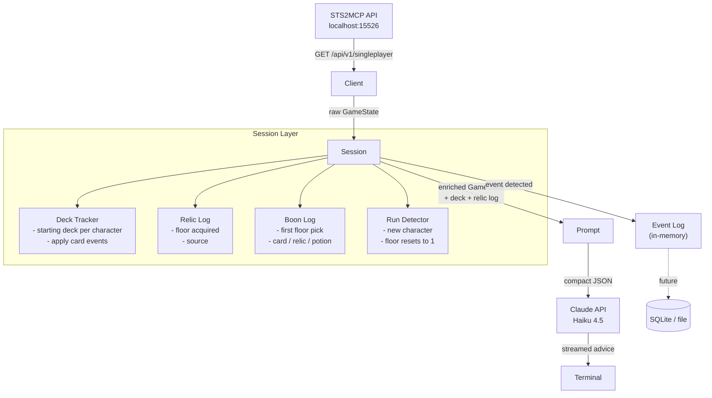

# Session-Aware Coach — Design

## Problem

The STS2MCP API only exposes deck data during combat. Outside combat (shop, card reward, rest site, map, events) the player object has no hand, no draw pile, no discard pile. This means Claude has no deck context for the most important decisions in the run — what card to pick, what to upgrade, what to buy.

Current workaround: cache the deck from the last combat and restore it. This breaks when:
- The coach starts mid-run before any combat
- A card is added, removed, or upgraded between combats
- A new run starts without the coach restarting

The fix is a **session layer** that owns the authoritative deck and relic state, built incrementally from known events as the run progresses.

---

## Architecture



---

## Session Lifecycle

```
game start
    │
    ├─ detect new run (floor=1, character changed, or explicit reset)
    │       → initialize session with character's starting deck
    │
    ├─ floor 1 boon event
    │       → record boon type (card / relic / potion) and item chosen
    │       → if card: add to deck
    │       → if relic: add to relic log
    │
    ├─ per floor:
    │   ├─ card_reward    → if card selected: deck.add(card)
    │   ├─ card_select    → if upgrade confirmed: deck.upgrade(card)
    │   ├─ shop           → if card bought: deck.add(card)
    │   │                 → if card removed: deck.remove(card)
    │   │                 → if relic bought: relicLog.add(relic, floor, "shop")
    │   ├─ rewards        → if relic claimed: relicLog.add(relic, floor, "combat_reward")
    │   ├─ relic_select   → relicLog.add(relic, floor, "boss_relic")
    │   ├─ treasure       → relicLog.add(relic, floor, "treasure")
    │   ├─ event          → parse for card/relic changes (best-effort)
    │   └─ combat         → sync deck from API (hand+draw+discard), reconcile diffs
    │
    └─ game_over / new run detected
            → archive session (future: persist to DB)
            → reset to clean state
```

---

## Data Model

### Session

```go
type Session struct {
    Character  string
    Act        int
    Floor      int
    Deck       []DeckEntry   // authoritative card list
    Relics     []RelicEntry  // current relics with acquisition context
    Boon       *BoonEntry    // first floor pick (nil if not yet taken)
    Events     []Event       // ordered log of all changes this run
    StartedAt  time.Time
}
```

### DeckEntry

```go
type DeckEntry struct {
    Name      string
    Cost      string
    Upgraded  bool
    Source    string  // "start", "card_reward", "shop_buy", "event", "boon", "bundle"
    FloorAdded int
}
```

### RelicEntry

```go
type RelicEntry struct {
    Name        string
    Source      string  // "combat_reward", "shop", "boss_relic", "treasure", "event", "boon"
    FloorAdded  int
}
```

### BoonEntry

```go
type BoonEntry struct {
    Type  string  // "card", "relic", "potion"
    Item  string
    Floor int
}
```

### Event (the log)

```go
type Event struct {
    Floor  int
    State  string  // which screen triggered it
    Type   string  // "card_added", "card_removed", "card_upgraded", "relic_added", "boon"
    Detail string  // card or relic name
}
```

---

## Starting Decks

Each character starts with a fixed deck. Session initializes from this on new run detection.

| Character | Starting Cards |
|---|---|
| The Ironclad | 5× Strike, 4× Defend, 1× Bash |
| The Silent | 5× Strike, 5× Defend, 1× Neutralize, 1× Survivor |
| The Defect | 4× Strike, 4× Defend, 4× Zap, 1× Dualcast |
| The Watcher | 4× Strike, 4× Defend, 1× Eruption, 1× Vigilance |
| The Regent | TBD — needs in-game verification |
| The Necrobinder | TBD — needs in-game verification |

> Starting decks for Regent and Necrobinder to be confirmed by running a new game and reading the first combat state from the API.

---

## Event Detection Logic

Detection works by comparing the current `GameState` to the previous one inside `Session.Update()`.

| Transition | What to check | Action |
|---|---|---|
| Any → `card_reward` | — | Snapshot offered cards for context |
| `card_reward` → next state | Relic count unchanged, floor unchanged | If card count in deck increased: `card_added` |
| Any → `card_select` | — | Flag that an upgrade/remove is in progress |
| `card_select` → next state | — | If deck has a new `+` card: `card_upgraded` |
| Any → `shop` | — | Snapshot shop inventory |
| `shop` → next state | Gold delta, relic count delta | If gold dropped + deck grew: `shop_buy_card`; if deck shrank: `shop_remove_card`; if relic count grew: `shop_buy_relic` |
| Any → `rewards` | — | — |
| `rewards` → next state | Relic count delta | If relic count grew: `combat_reward_relic` |
| `relic_select` → next state | Relic count delta | `boss_relic` |
| `treasure` → next state | Relic count delta | `treasure_relic` |
| Floor = 1, new character | — | New run detected → reset session |
| Combat state | Always | Sync deck from API, reconcile against session deck |

---

## Combat Reconciliation

The API gives us the ground truth during combat (hand + draw + discard). The session uses this to catch anything the event detection missed — cards from events that didn't change state cleanly, mod interactions, etc.

```
combatDeck = hand ∪ draw_pile ∪ discard_pile  (from API)
sessionDeck = session.Deck

diff = combatDeck - sessionDeck
if diff not empty:
    log("reconcile: adding unseen cards", diff)
    session.Deck += diff
```

This makes the system self-correcting. Event detection handles the happy path; combat reconciliation is the safety net.

---

## Integration with Prompt Builders

Both `buildCombatCompact` and `buildNonCombatCompact` stop reading `gs.Player.DrawPile` directly. Instead they receive a `*session.Session` and pull from `session.Deck`.

```go
// before
deck = gs.Player.DrawPile + gs.Player.DiscardPile

// after
deck = session.Deck  // always current, always complete
```

The prompt also gets a `session.RecentEvents` summary — last 3–5 notable events (e.g. "Floor 6: picked up Nunchaku", "Floor 9: upgraded Shatter") — so Claude has run narrative context, not just current state.

---

## What This Does NOT Cover (yet)

- **Persistence** — session lives in memory, lost on coach restart. Future: write to `~/.local/share/sts2-coach/sessions/` as JSON or SQLite.
- **Event card parsing** — some events add/remove cards in non-obvious ways. Best-effort detection via combat reconciliation covers these.
- **Multiplayer** — out of scope.

---

## Build Order

1. `internal/session` package — `Session`, `DeckEntry`, `RelicEntry`, `BoonEntry`, `Event`
2. Starting deck registry per character
3. `Session.Update(prev, curr GameState)` — event detection + combat reconciliation
4. Wire session into `STS2Client` — replace `lastDeck` with `Session`
5. Update prompt builders to accept `*session.Session`
6. Update `main.go` — pass session through to prompts
7. Add `session.RecentEvents()` summary to prompts
8. Verify with live game — check reconciliation catches missed events
